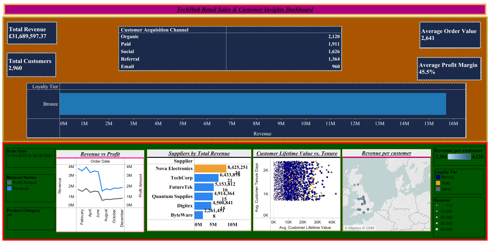

# TechHub Retail Sales & Customer Insights Dashboard

**Tools:** Tableau Public  
**Domain:** Retail / Business Intelligence  
**Datasets:** Sales transactions, customer demographics, product catalogue (3 sources, 12,000+ records)

---

## Project Overview

TechHub Retail is a UK-based online electronics retailer preparing for 2025 strategic planning. This executive dashboard integrates 18 months of sales, customer, and product data to identify growth opportunities, analyse performance trends, and deliver actionable recommendations to senior leadership.

---

## Dashboard Preview

---

## Business Questions Answered

- Which product categories and suppliers offer the best profit margins?
- How do customer demographics impact purchasing behaviour?
- What seasonal patterns exist across product categories and regions?
- Which acquisition channels deliver the highest lifetime value customers?
- How does product age correlate with sales performance?

---

## Key Features

**6 KPI Cards** - Total Revenue, Average Order Value, Total Customers, Customer Acquisition Rate, Average Profit Margin (45.5%), Top Customer Segment

**Sales & Profitability Trends** - Dual-axis line chart showing Revenue vs Profit Amount over 18 months

**Geographic Performance** - UK regional map showing revenue per customer with city-level drill-down

**Supplier Performance** - Horizontal bar chart highlighting Nova Electronics as top revenue supplier (£8.4M), with per-supplier product count detail

**Customer Segmentation** - Scatter plot of Customer Lifetime Value vs Tenure, segmented by loyalty tier (Gold/Silver/Bronze)

**Interactive Filters** - Date range slider, product category selector, affecting all views simultaneously

---

## Key Findings

- **Total revenue of £31.7M** across 18 months with a healthy **45.5% profit margin**
- **Nova Electronics** is the top supplier by a significant margin (£8.4M vs £6.4M for TechCorp)
- **Gold-tier customers** have the highest lifetime value and longest tenure — retention investment is justified
- **Organic and Paid channels** bring the highest customer acquisition volumes (2,120 and 1,911 respectively)
- **Bronze loyalty tier** accounts for the majority of orders — a large segment with upsell potential

---

## Data Sources

| File | Description | Size |
|------|-------------|------|
| TechHub_Sales_Data.csv | 18 months of transactions (Jan 2023 – Jun 2024) | 12,000+ rows |
| TechHub_Customers.csv | Customer demographic and loyalty data | 3,500+ customers |
| TechHub_Products.csv | Product catalogue with cost and margin data | 300+ products |

---

## Calculated Fields Created in Tableau

- `Profit Amount` = Revenue - (Cost Price × Quantity)
- `Profit Margin %` = SUM(Profit Amount) / SUM(Revenue) - weighted average to avoid ratio distortion
- `Customer Tenure Days` = DATEDIFF('day', Signup Date, TODAY())
- `Customer Lifetime Value` = SUM(Revenue) per customer
- `Product Age Days` = DATEDIFF('day', Launch Date, Order Date)

---

## How to View

The dashboard was built in **Tableau Desktop** and published to **Tableau Public**.  
Download the `.twbx` file and open in Tableau Desktop, or view the interactive version via the Tableau Public link above.

**Requirements:** Tableau Desktop or Tableau Public (free)

---

*Dataset is fictional and used for educational purposes.*
